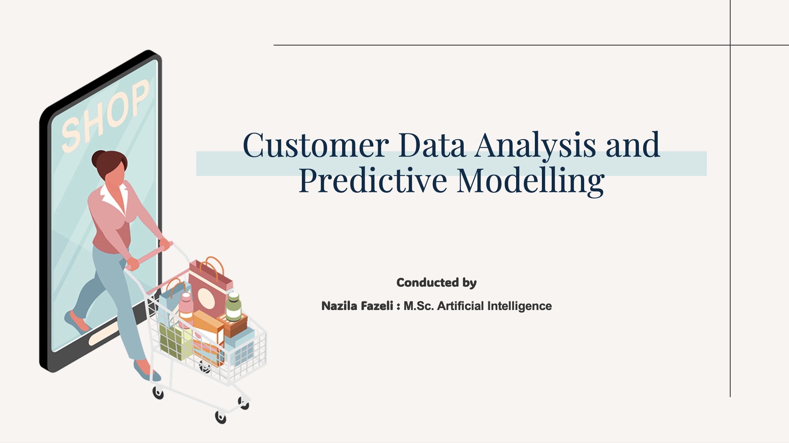

# Customer Segmentation & Predictive Modeling

This project explores customer behavior using a rich dataset of demographic and transactional attributes.  
The analysis was conducted in **Radiant** and visualized using **Tableau**, with the goal of enabling effective business decisions based on customer segmentation, predicted spending, and marketing response behavior.

---

## 📌 Project Objectives

- Predict total customer spending using regression techniques  
- Identify customers likely to respond to marketing campaigns  
- Segment customers based on demographic and behavioral attributes  
- Provide actionable insights for targeted marketing, dashboard visualization, and retention strategies

---

## 📊 Dataset Overview

This project uses the **Customer Personality Analysis** dataset from Kaggle:  
[https://www.kaggle.com/datasets/imakash3011/customer-personality-analysis](https://www.kaggle.com/datasets/imakash3011/customer-personality-analysis)

The dataset includes:
- Demographic information: Year of Birth, Income, Marital Status, Children
- Behavioral data: Purchases in various categories, marketing campaign responses
- Online/offline channel interactions: Web visits, catalog orders, store purchases

Original format: Excel  
Cleaned and processed using Tableau, analyzed in Radiant, and visualized using Tableau Public.

---

## 🧭 Project Workflow (15 Steps)


1. **Initial Data Cleaning**  
   Cleaned the raw Excel file using Tableau’s Data Interpreter. Unnecessary rows/columns were removed, and a structured CSV was exported.

2. **Data Exploration**  
   Loaded the cleaned CSV into Radiant. Explored variable types and distributions to gain an understanding of the dataset and its structure.

3. **Manual Outlier Removal**  
   Removed invalid records such as:  
   - Unrealistic birth year (e.g., 1893)  
   - Non-standard Marital Status entries like "YOLO", "Alone"  
   - Extreme income values like 666,666

4. **Handling Missing Values**  
   Rows with missing values in important columns (especially Income) were dropped to ensure a reliable modeling foundation.

5. **Outlier Removal Using Statistical Methods**  
   Applied Z-Score and IQR methods to detect and remove statistical outliers. Z-Score was preferred for retaining more useful data.

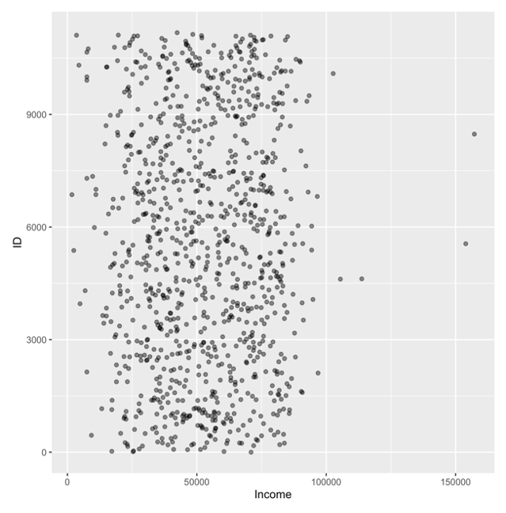
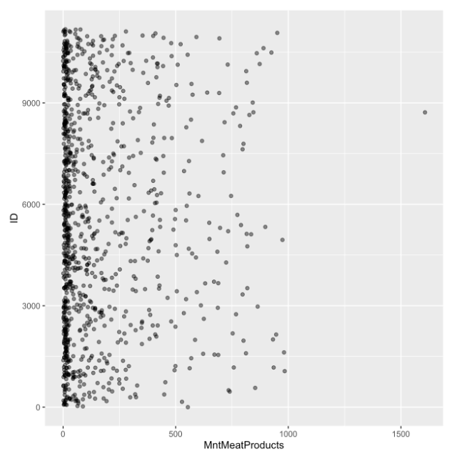

6. **Feature Engineering**  
   Created several new variables:
   - `Relationship Status` (Instead of Marital Status)
   - `Total Family Size` (children + marital status)
   - `Age` (from year of birth)
   - `Total Spend` (sum of spending on all product categories)
   - `Total Accepted Campaigns` (number of accepted offers)
    
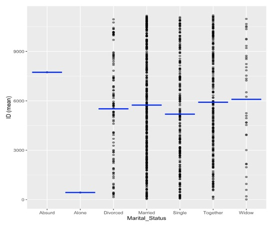
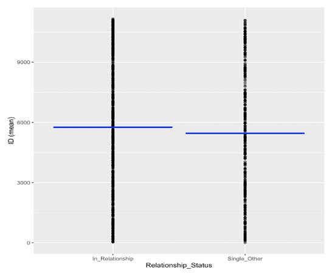

7. **Target Definition for Regression**  
   Target: `Log Total Spend`  
   Chosen due to the exponential relationship between spending and income.

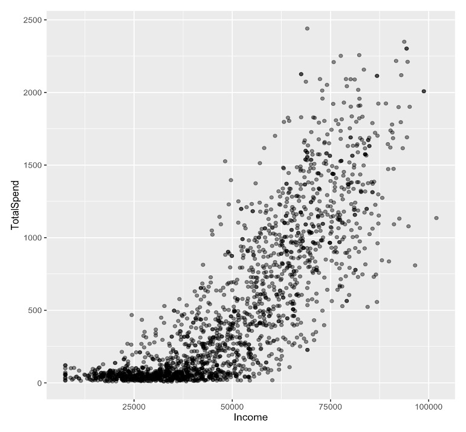
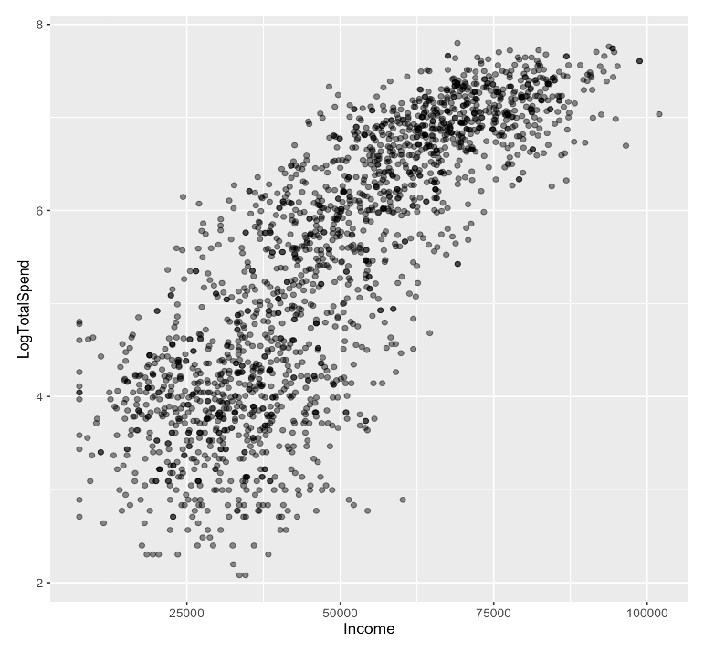

8. **Correlation Analysis for Regression**  
   Analyzed multicollinearity among independent variables.  
   Although some variables were moderately correlated (70–75%), testing with multiple seeds confirmed these did not harm model performance.

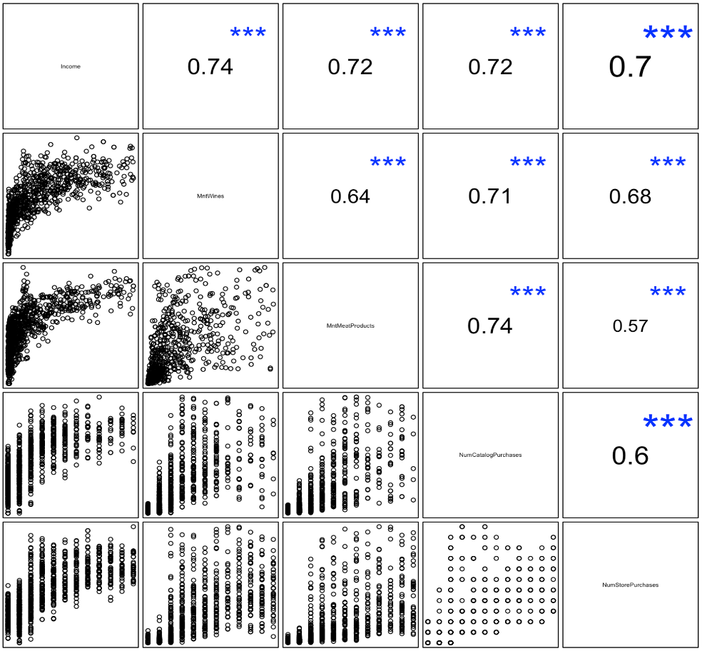

9. **Feature Selection for Regression**  
   Using stepwise regression and manual refinement, selected the 9 most predictive variables for modeling total spend.

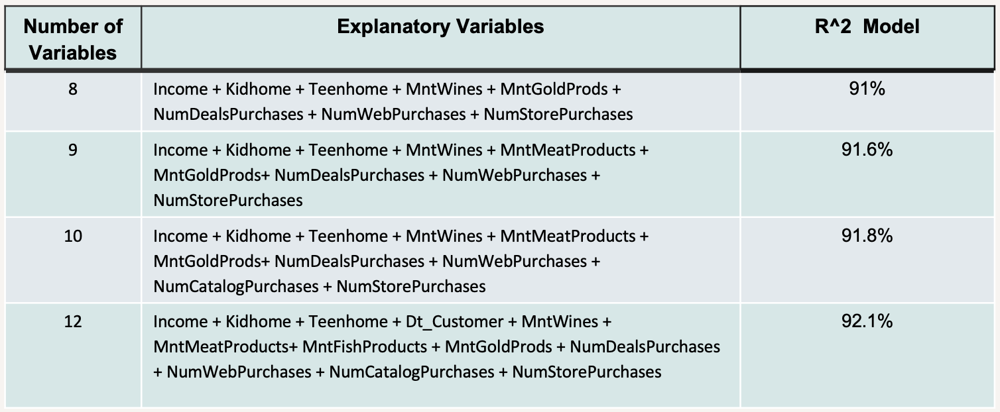

10. **Linear Regression Modeling and Evaluation**  
    Built a regression model to predict `Log Total Spend`.  
    Model achieved R² > 90% on both training and testing sets, indicating excellent accuracy.

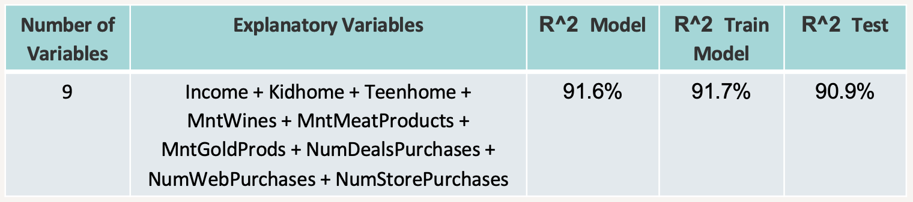

11. **Target Selection & Modeling for Classification**  
    Initially attempted to predict complaints, but due to class imbalance, shifted to predicting customer `Response` to the latest campaign.  
    - **Sensitivity:** 94.1% → Accurately identifies responders  
    - **Specificity:** 72.7% → Effectively excludes non-responders  
    - **Accuracy:** 75.7%, compared to a baseline of 86.3%  
    Despite lower accuracy, the model’s high sensitivity makes it highly valuable for targeting responsive customers in future campaigns.

0.09.png" alt="Threshold>0.09" width="300"/>
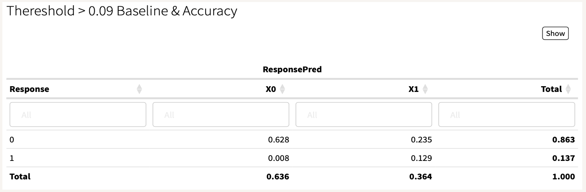
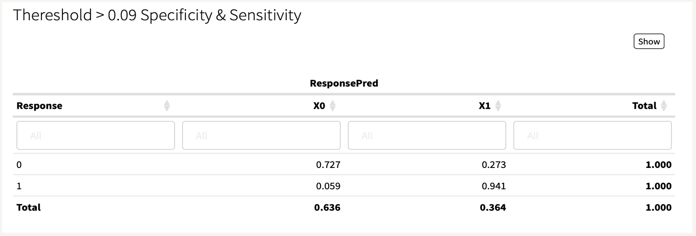

12. **Customer Clustering (Segmentation)**  
    Hierarchical clustering was tested first, then refined using K-Means with 3 final clusters:
    - **High Spenders:** Loyal and consistent customers
    - **Moderate Spenders:** Average engagement and spending
    - **Low Spenders:** Minimal activity, possible churn risk  
    These clusters provide clear insights for campaign targeting, personalized offers, and loyalty strategies.

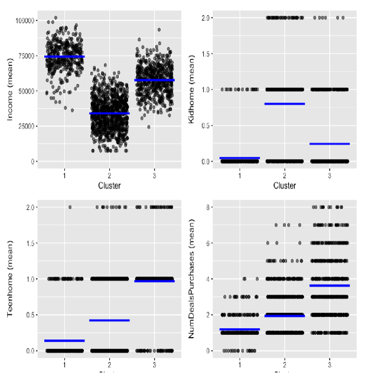
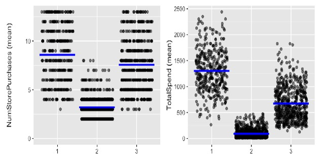

13. **Cluster-Specific Model Evaluation**  
    Linear and classification models were re-tested within clusters.  
    The global model performed better overall, but the cluster structure remains useful for business segmentation and planning.

14. **Data Visualization in Tableau**  
    Transferred insights and summaries to Tableau and built dashboards visualizing demographic, behavioral, and predictive results.

15. **Dashboard Creation & Storytelling**  
    Dashboards were grouped into four thematic areas and published on Tableau Public for stakeholder access and presentation.

---

## 📈 Final Dashboards (Tableau Public)

The dashboards are grouped into four main categories:
1. **Demographic Analysis** (2 dashboards)  
2. **Behavioral Patterns** (4 dashboards)  
3. **Customer Clustering** (7 dashboards)  
4. **Total Spend Analysis** (5 dashboards)

**[View the Interactive Dashboards on Tableau Public](https://public.tableau.com/views/CustomerDataAnalysisPredictiveModelling/TotalSpend5)**

---

## 📁 Project Structure

```
customer-segmentation-project/
├── data/
│   └── Radiant1_Var_Null_Trans_Birth_Marital_marketing_campaign.csv
├── reports/
│   ├── R2Model_OLS_12_10_9_8_Variables.zip
│   ├── R2ModelOLS_Diff_Seeds_9_Variables.zip
│   ├── OLS-9Variables-R2.zip
│   ├── GLMReport(10Variables).zip
│   └── K-Mean Clustering.zip
├── tableau/
│   ├── NazilaFazeli.twbx
│   └── dashboard_screenshots/
│       ├── demographic/
│       ├── behavioral/
│       ├── clustering/
│       └── total_spend/
├── presentation/
│   └── NazilaFazeli_Customer_Data_Analysis.pptx
├── images/
├── README.md
└── requirements.txt
```

---

## 🔧 Tools Used

- **Radiant** – Data analysis, regression, classification, and clustering  
- **Tableau** – Visualization and dashboard storytelling  
- *(Python was not used in this project)*

---

## 👩‍💻 Author

**Nazila Fazeli**  
*M.Sc. Artificial Intelligence*

> “You are already naked; there is no reason not to follow your heart.”  
> — Steve Jobs
