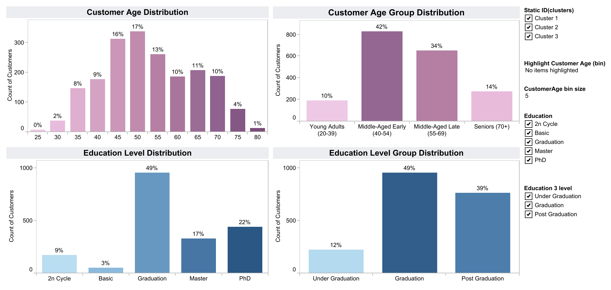
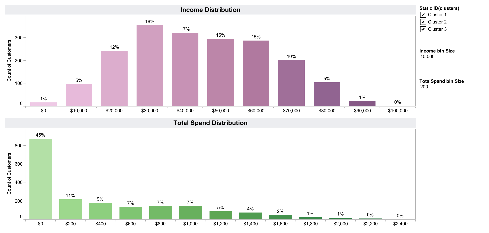
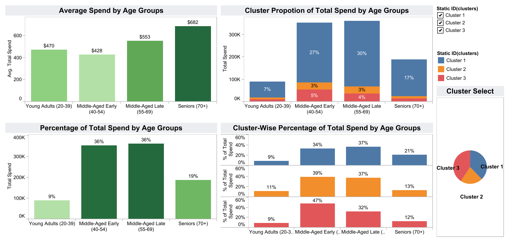
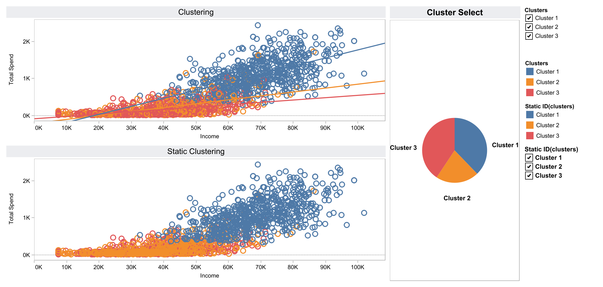
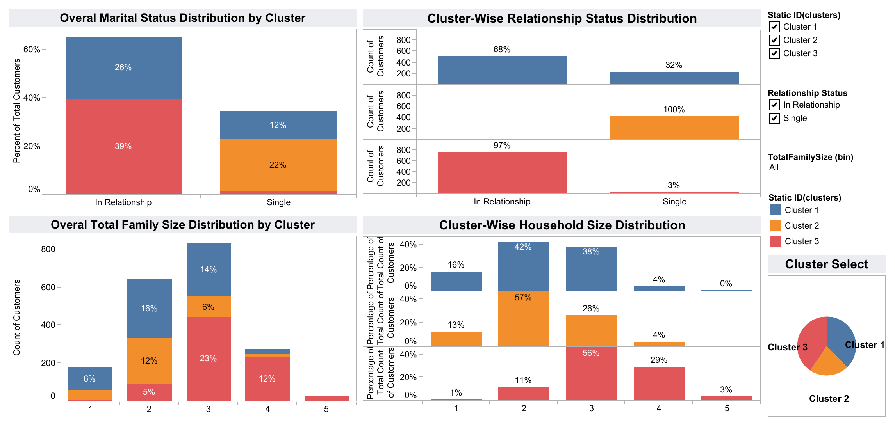

# Customer Segmentation & Predictive Modeling

This project explores customer behavior using a rich dataset of demographic and transactional attributes.  
The analysis was conducted in **Radiant** and visualized using **Tableau**, with the goal of enabling effective business decisions based on customer segmentation, predicted spending, and marketing response behavior.

---

## 📌 Project Objectives

- Predict total customer spending using linear regression models.
- Classify customer responses to marketing campaigns using GLM.
- Segment customers using K-Means clustering based on behavioral and demographic data.
- Visualize the analysis results and extract further behavioral patterns using Tableau dashboards.
- Support marketing strategies through meaningful data-driven insights.

---

## 📊 Dataset Overview

- Name: Customer Personality Analysis  
- Source: [Kaggle Dataset](https://www.kaggle.com/datasets/imakash3011/customer-personality-analysis)  
- Records: 2240 customers  
- Features: Demographic and behavioral attributes including Year of Birth, Education, Marital Status, Income, Kidhome, Teenhome, Spending data, Campaign responses, etc.

Original format: Excel  
Cleaned and processed using Tableau, analyzed in Radiant, and visualized using Tableau Public.

---

## 🧭 Project Workflow (14 Steps)


1. **Initial Data Cleaning**  
   Cleaned the raw Excel file using Tableau’s Data Interpreter. Unnecessary rows/columns were removed, and a structured CSV was exported.

2. **Data Exploration**  
   Loaded the cleaned CSV into Radiant. Explored variable types and distributions to gain an understanding of the dataset and its structure.

3. **Manual Outlier Removal**  
   Removed invalid records such as:  
   - Unrealistic birth year (e.g., 1893)  
   - Non-standard Marital Status entries like "YOLO", "Alone"  
   - Extreme income values like 666,666

4. **Handling Missing Values**  
   Rows with missing values in important columns (especially Income) were dropped to ensure a reliable modeling foundation.

5. **Outlier Removal Using Statistical Methods**  
   Applied Z-Score and IQR methods to detect and remove statistical outliers. Z-Score was preferred for retaining more useful data.


6. **Feature Engineering**  
   Created several new variables:
   - `Relationship Status` (Instead of Marital Status)
   - `Total Family Size` (children + marital status)
   - `Age` (from year of birth)
   - `Total Spend` (sum of spending on all product categories)
   - `Total Accepted Campaigns` (number of accepted offers)
    


7. **Target Definition for Regression**  
   We aimed to predict Total Spend, and log-transformed it (`Log_Total_Spend`) to better model the exponential relationship with income.


8. **Correlation Analysis for Regression**  
   Analyzed multicollinearity among independent variables.  
   Although some variables were moderately correlated (70–75%), testing with multiple seeds confirmed these did not harm model performance.


9. **Feature Selection for Regression**  
   Using stepwise regression and manual refinement, selected the 9 most predictive variables for modeling total spend.


10. **Linear Regression Modeling and Evaluation**  
    Built a regression model to predict `Log Total Spend`.  
    Model achieved R² > 90% on both training and testing sets, indicating excellent accuracy.


11. **Target Selection & Modeling for Classification**  
    Initially attempted to predict complaints, but due to class imbalance, shifted to predicting customer `Response` to the latest campaign.  
    - **Sensitivity:** 94.1% → Accurately identifies responders  
    - **Specificity:** 72.7% → Effectively excludes non-responders  
    - **Accuracy:** 75.7%, compared to a baseline of 86.3%  
    Despite lower accuracy, the model’s high sensitivity makes it highly valuable for targeting responsive customers in future campaigns.

0.09.png" alt="Threshold>0.09" width="400"/>


12. **Customer Clustering (Segmentation)**  
    Hierarchical clustering was tested first, then refined using K-Means with 3 final clusters:
    - **High Spenders:** Loyal and consistent customers
    - **Moderate Spenders:** Average engagement and spending
    - **Low Spenders:** Minimal activity, possible churn risk  
    These clusters provide clear insights for campaign targeting, personalized offers, and loyalty strategies.


13. **Dashboard Visualization in Tableau**
    We created a series of dashboards in Tableau to explore and communicate customer insights. These dashboards were built using cleaned and feature-engineered data and were categorized as follows:

- Demographic dashboards (2 dashboards)
- Behavioral dashboards (4 dashboards)
- Clustering dashboards (7 dashboards)
- Total Spend dashboards (5 dashboards)
  




These visualizations enabled intuitive exploration of customer traits, purchase behavior, and campaign engagement. The full dashboard collection can be accessed on [Tableau Public](https://public.tableau.com/views/CustomerDataAnalysisPredictiveModelling/TotalSpend5).

14. **Visual Clustering & Behavioral Insight in Tableau**
    Building upon the dashboards, an independent visual clustering analysis was conducted in Tableau. This revealed three distinct customer segments based on income, spending behavior, and household composition:

- Cluster A: Higher-income customers whose total spend increased consistently with income.
- Cluster B: Middle-income, predominantly single customers. As income increased, their spending also rose significantly — likely due to small household sizes and fewer expenses.
- Cluster C: Customers with income levels similar to Cluster B, but whose spending remained flat despite income growth.

By layering multiple dimensions (income, total spend, marital status), we identified Cluster B as a highly responsive group, offering valuable insights for targeted campaign planning.




> This Tableau-based segmentation is separate from the K-Means clustering performed in Radiant and was discovered through exploratory visual analytics.

---
## 📁 Project Structure

```
customer-segmentation-project/
├── data/
│   └── Radiant1_Var_Null_Trans_Birth_Marital_marketing_campaign.csv
├── reports/
│   ├── R2Model_OLS_12_10_9_8_Variables.zip
│   ├── R2ModelOLS_Diff_Seeds_9_Variables.zip
│   ├── OLS-9Variables-R2.zip
│   ├── GLMReport(10Variables).zip
│   └── K-Mean Clustering.zip
├── tableau/
│   ├── NazilaFazeli.twbx
│   └── dashboard_screenshots/
│       ├── demographic/
│       ├── behavioral/
│       ├── clustering/
│       └── total_spend/
├── presentation/
│   └── NazilaFazeli_Customer_Data_Analysis.pptx
├── images/
├── README.md
└── requirements.txt
```

---

## ✅ Summary

This project showcases a full data science pipeline: from raw data cleaning to advanced modeling and impactful visualization. It combines regression, classification, clustering, and Tableau dashboards to uncover actionable insights about customer behavior and campaign responsiveness — a foundation for smarter, data-driven marketing decisions.

---
## 👩‍💻 Author

**Nazila Fazeli**  
*M.Sc. Artificial Intelligence*

> “You are already naked; there is no reason not to follow your heart.”  
> — Steve Jobs
